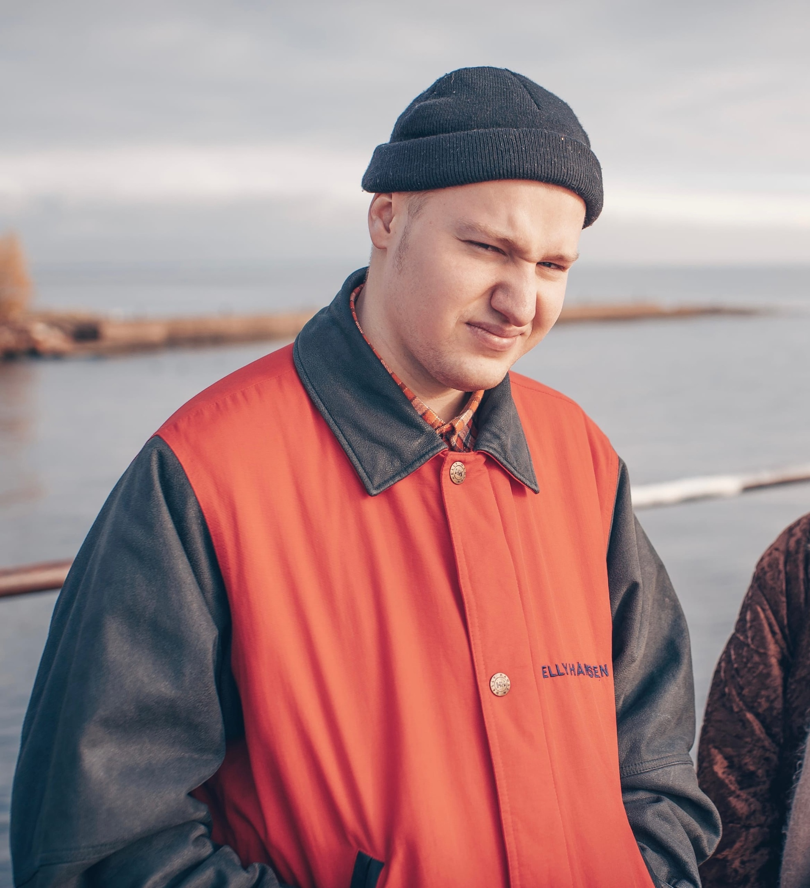

# Привет!

**Меня зовут ***Никита*** и я начинающий [frontend](https://en.wikipedia.org/wiki/Front-end_web_development "Что это?") разработчик!**

## На данный момент я успешно изучил следующие темы:

1. HTML-верстка: с нуля до первого макета
2. Адаптивная и мобильная верстка
3. Основы программирования
4. Git — система контроля версий

## Мои работы:

* [Одностраничный сайт](https://cunodngaf.github.io/-DF/ "Сайт")
* [Логика для игры Крестики-Нолики](https://replit.com/@NikitaMatrosov/diplom#logic.js "Крестики-Нолики")
